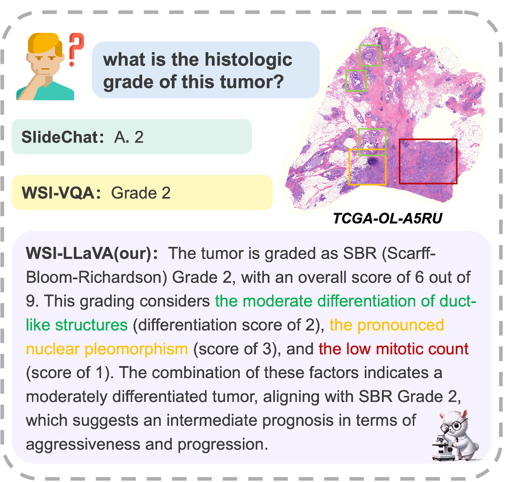
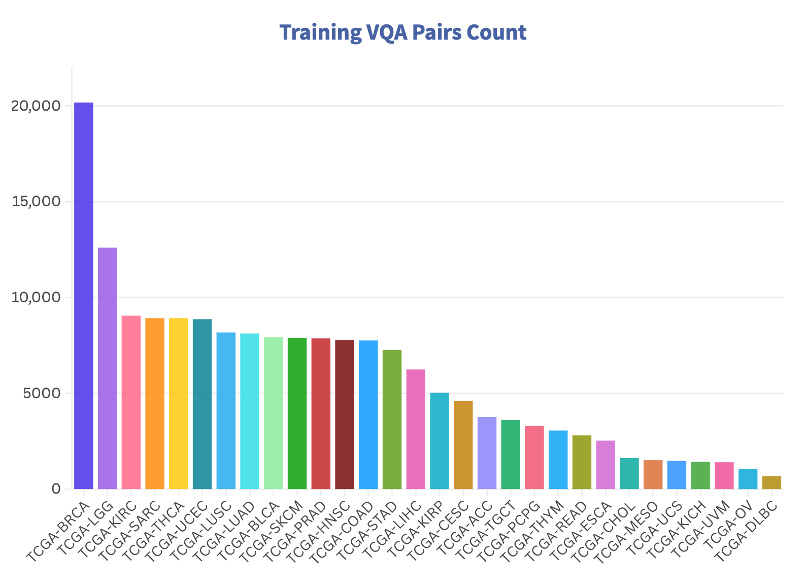
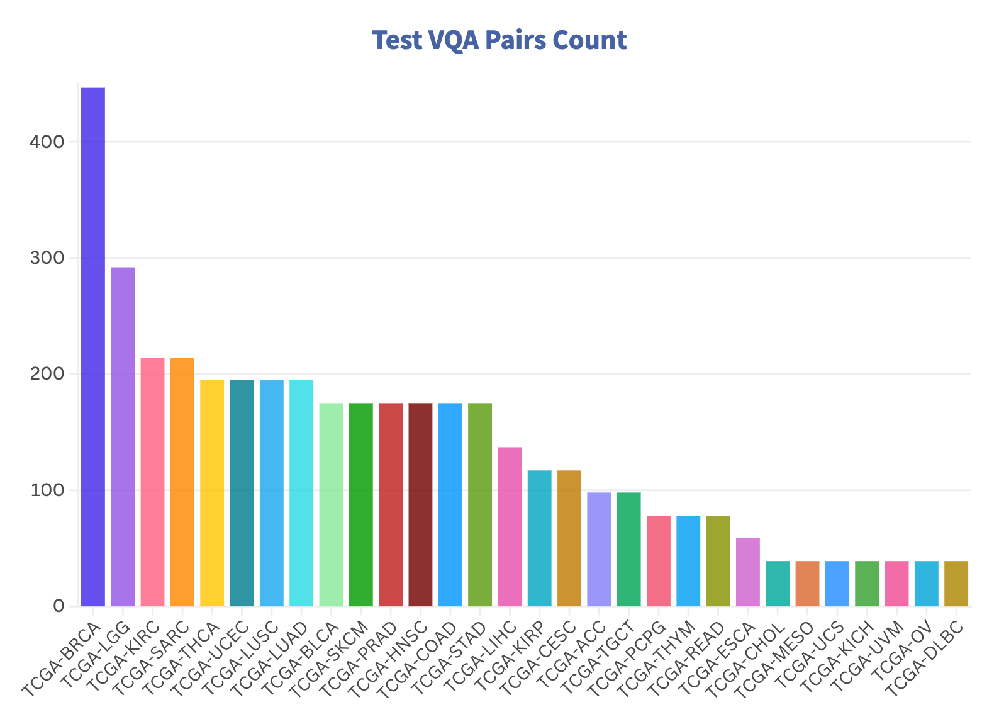
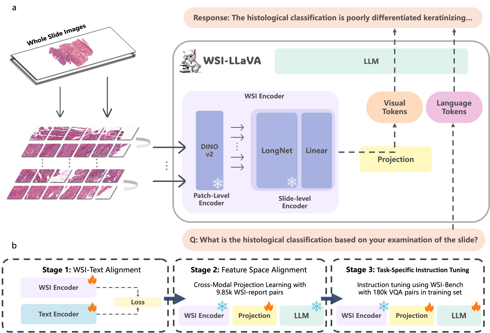
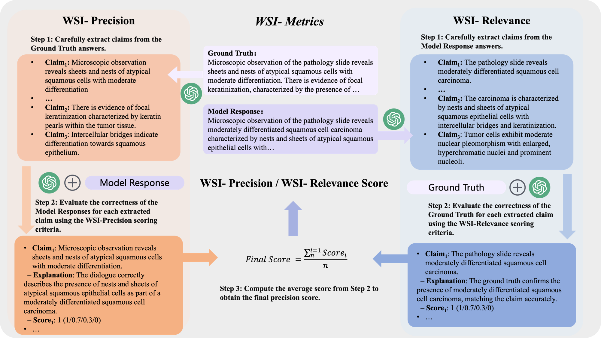

#  WSI-LLaVA: A Multimodal Large Language Model for Whole Slide Image (ICCV 2025)



🏠 **[Homepage](https://wsi-llava.github.io/)** | 🤗 **[huggingface](https://huggingface.co/Lucas-yuc/wsi-llava-v1.5-7b-e1)** | 📖 **[Paper](https://arxiv.org/abs/2412.02141)**

**WSI-LLaVA** is a multimodal large language model designed for Whole Slide Image (WSI) analysis, bridging the gap between gigapixel WSIs and textual descriptions. It introduces innovative methods and benchmarks for advancing pathology-focused AI research.

<br clear="right"/>


## 📂 Open Resources

We are committed to transparency and open science. Currently, the following resources are available:

- 📄 **[Test Dataset](./dataset/)**: A subset of VQA pairs and WSI data covering 30 cancer types, including a testing set of 208 WSIs with 4,119 VQA pairs.
- 📚 **[Train Dataset](./dataset/)**: A comprehensive collection of VQA pairs and WSI data covering 30 cancer types, including 9,642 WSIs with 175,450 VQA pairs. Now publicly available！

<p align="center">
  
  
</p>

> **Note:** TCGA images included in the dataset can be downloaded from the [TCIA Portal](https://portal.imaging.datacommons.cancer.gov/explore/).

> **Note:** Additional dataset partitions and fine-tuned weights will be released in future updates.

---


## 🚀 Usage

### Step 1: Slide Feature Extraction Modification

#### Base Repository
Based on [prov-gigapath](https://github.com/prov-gigapath/prov-gigapath/tree/main). This is the slide encoder part for feature extraction in our model.

#### Modified File
`gigapath/slide_encoder.py`

#### Change Description

Modified the global pooling section in the `forward` method of `LongNetViT` class:

**Before:**

```python
if self.global_pool:
    x = x[:, 1:, :].mean(dim=1)  # global average pooling
    outcome = self.norm(x)
```

**After:**

```python
if self.global_pool:
    x = x[:, 1:, :]
    x = torch.nn.functional.adaptive_avg_pool1d(x.permute(0, 2, 1), 576).permute(0, 2, 1)
    outcome = self.norm(x)
```

Replaced global average pooling with `adaptive_avg_pool1d` to compress sequence length to a fixed 576 tokens. The output dimension is (576, 768), which is then padded with zeros to (576, 1024) for downstream processing.

#### 🔱 Trident-Based Feature Extraction (Recommended Method)

You can also use **[Trident](https://github.com/mahmoodlab/Trident)**, a toolkit for large-scale whole-slide image processing, to load different pathology foundation models (such as **Titan** and **Prov-Gigapath**) and extract features from whole-slide images. The extracted features have a shape of **(576, xx)**, which can then be padded with zeros to **(576, 1024)** and saved as **.pt files** for **model training and inference**.


### Step 2: Model training

Run the following script for model training:

```
./WSI_LLAVA/scripts/v1_5/finetune_lora.sh
```

`--image_folder`: path to the extracted feature files (`.pt` files)

`--data_path`: path to the training data (`.json` files)

`--output_dir`: path to save the trained model weights

⬇️ You can download the training dataset from [WSI-Bench Train Dataset](https://huggingface.co/datasets/Lucas-yuc/WSI-Bench/blob/main/WSI-Bench-train.json).

### Step 3: Model Inference

Run the following script for model inference:

```
./WSI_LLAVA/scripts/wsi-vqa.sh
```

⬇️ **Important Notice (March 2026)**  

We sincerely apologize for the confusion caused by our previous weight release.

The previously uploaded checkpoint corresponds to an improved version of the model that achieves better performance than the results reported in the paper. Therefore, it does not exactly reproduce the experimental results described in the publication.

If you would like to reproduce the results reported in the paper, please use the following checkpoint:

👉 https://huggingface.co/Lucas-yuc/wsi-llava-v1.5-7b-e1  

The currently available weights (v1.5-7b-14) correspond to the improved model version.

We apologize for the oversight and appreciate your understanding.


🧪 You can use this file for testing: [WSI-Bench Open Questions](https://huggingface.co/datasets/Lucas-yuc/WSI-Bench/blob/main/WSI-Bench-open-question.jsonl).


## 🏗️ Architecture

WSI-LLaVA consists of three core components:
1. **WSI Encoder**: Processes gigapixel WSIs for feature extraction.
2. **Projection Layer**: Aligns WSI features with textual embeddings.
3. **Large Language Model**: Generates context-aware and clinically relevant textual responses.

The training strategy incorporates three key stages for optimal performance on gigapixel WSIs.



---

## 📊 WSI-Bench

In clinical practice, morphological features such as tissue and cellular structural abnormalities play a critical role in diagnosis. Existing models often overlook these crucial details. To address this, we propose **WSI-Bench**:

- **Scope**: 180k VQA pairs from 9,850 WSIs, spanning 30 cancer types and sourced from 8,368 patients.
- **Tasks**: 11 pathology-focused VQA tasks designed to evaluate three major pathological capabilities.


---

## 📏 WSI-Metrics

Traditional NLU metrics like BLEU and ROUGE cannot accurately assess pathology performance due to complex medical terminology. We introduce two specialized metrics:

- **WSI-Precision**: Measures accuracy of model responses against ground-truth claims
- **WSI-Relevance**: Measures alignment of model responses with clinical relevance

These domain-specific metrics provide more clinically relevant assessment than traditional NLU metrics, with strong correlation to expert evaluations.



---
